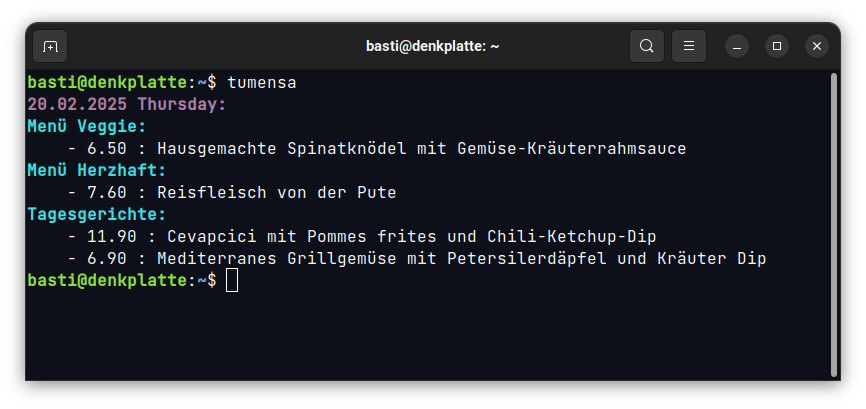

# TU Wien Mensa

Get the menu of the day from the TU Wien Mensa directly on your terminal.



## Compile & Install

If you have the Go programming language installed, you can simply install the program with the following command.
It will be added to your `$GOPATH/bin` directory. Thus also on your `$PATH` and runnable from anywhere.

```bash
go install github.com/schicho/tumensa/cmd/tumensa@latest
```

Alternatively, you can of course go through the manual git clone and go build process.

In case you don't have Go installed, you can download the latest release from the releases page here on GitHub.
You can see the releases in the sidebar on the right.
Depending on your operating system, download and extract the archive and move the binary to a directory in your `$PATH`.
You can then run the program from anywhere in your terminal.
